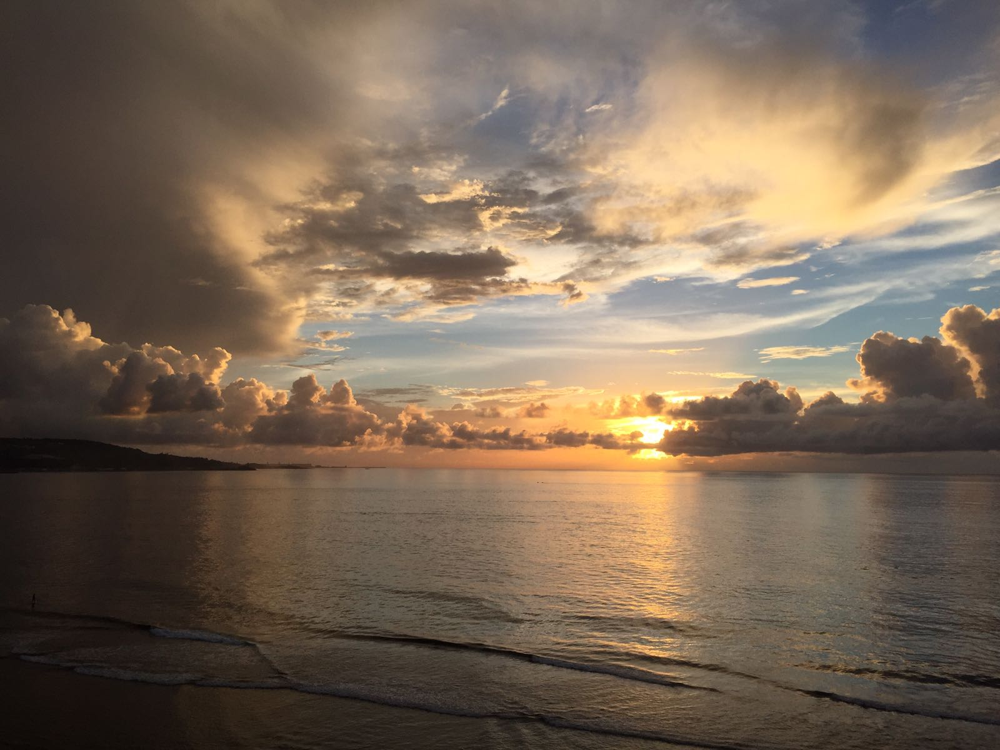

# Rachel Lin
###### School year: 4th year
###### Major: Mathematics-Computer Science

[Guam flag](guamflag.png)
## My Background
I was born and raised on **Guam**

All the information you have to know about Guam is [here](https://www.guamvisitorsbureau.com/)!

My favorite quote is:
> "All our dreams can come true, if we have the courage to pursue them." - Walt Disney

## College/Career
The newest Git code I have learned are:
```
git status
git add
git commit
```

My favorite places to eat in SD in no particular order:
- The Taco Stand
- Wa Okan Dining
- Manna's BBQ

My favorite programming languages in order:
1. Python
2. C++
3. Java

These are the classes I need to take to graduate:
- [] CSE 110
- [] Math 111A
- [] CSE 101
- [] Math 181A

